## Bay Area Launch Dataset

FreeWash Finder is currently running with verified static seed data covering:

- **${bayAreaStaticOffers.length}** free wash offers
- **${new Set(bayAreaStaticOffers.map(o => o.city)).size}** Bay Area cities  
- **${new Set(bayAreaStaticOffers.map(o => o.region)).size}** regions

### Current Coverage

**Cities:**  
${Array.from(new Set(bayAreaStaticOffers.map(o => o.city))).join(', ')}

**Businesses:**  
${Array.from(new Set(bayAreaStaticOffers.map(o => o.businessName))).join(', ')}

### Next Steps

1. Build scraper/import pipeline for live offer updates
2. Expand verification system
3. Add real-time route intelligence

## Environment Configuration

Required variables:
```bash
NEXT_PUBLIC_SUPABASE_URL=your-supabase-url
NEXT_PUBLIC_SUPABASE_ANON_KEY=your-anon-key
```

Feature flags (defaults shown):
```bash
# Enable experimental route intelligence
<p align="center">
  <picture>
    <source media="(prefers-reduced-motion: reduce)" srcset="assets/hero/hero-reduced.svg">
    <source media="(prefers-color-scheme: light)" srcset="assets/hero/hero-light.svg">
    
  </picture>
</p>

<p align="center">
  <picture>
    <source media="(prefers-reduced-motion: reduce)" srcset="assets/hero/computational-dark.svg">
    <source media="(prefers-color-scheme: light)" srcset="assets/hero/computational-light.svg">
    
  </picture>
</p>

NEXT_PUBLIC_BETA_ROUTE_INTEL=off

# Enable user submissions
NEXT_PUBLIC_ENABLE_SUBMISSIONS=off  

# Configure available categories
NEXT_PUBLIC_FREEONOMY_CATEGORIES="free-car-wash,free-membership-trial"

# Default regions to show
NEXT_PUBLIC_DEFAULT_REGION="South Bay,Peninsula,East Bay"
```

## Getting Started

First, run the development server:

```bash
npm run dev
# or
yarn dev
# or
pnpm dev
# or
bun dev
```

Open [http://localhost:3000](http://localhost:3000) with your browser to see the result.

You can start editing the page by modifying `app/page.tsx`. The page auto-updates as you edit the file.

This project uses [`next/font`](https://nextjs.org/docs/app/building-your-application/optimizing/fonts) to automatically optimize and load [Geist](https://vercel.com/font), a new font family for Vercel.

## Learn More

To learn more about Next.js, take a look at the following resources:

- [Next.js Documentation](https://nextjs.org/docs) - learn about Next.js features and API.
- [Learn Next.js](https://nextjs.org/learn) - an interactive Next.js tutorial.

You can check out [the Next.js GitHub repository](https://github.com/vercel/next.js) - your feedback and contributions are welcome!

## Deploy on Vercel

The easiest way to deploy your Next.js app is to use the [Vercel Platform](https://vercel.com/new?utm_medium=default-template&filter=next.js&utm_source=create-next-app&utm_campaign=create-next-app-readme) from the creators of Next.js.

Check out our [Next.js deployment documentation](https://nextjs.org/docs/app/building-your-application/deploying) for more details.
